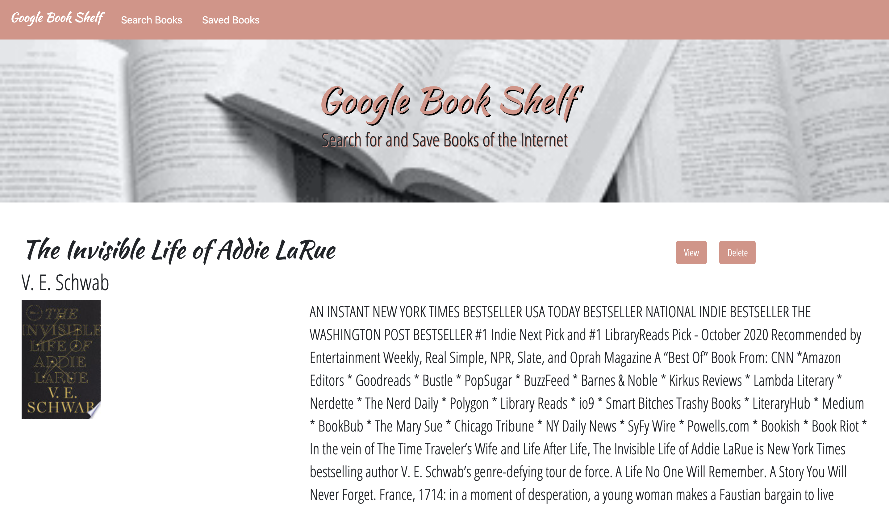
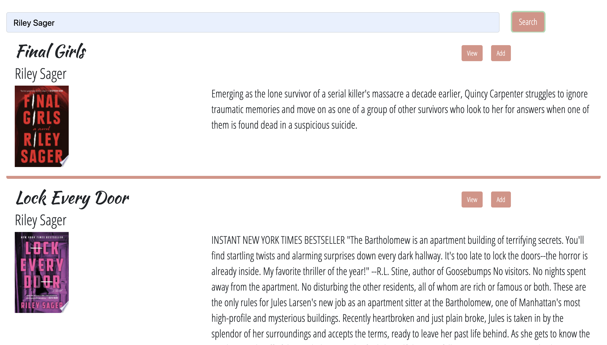

# Google Book Shelf

## Description

This Google Book Shelf application follows the MERN Stack framework, utilizes Google Books API to search for books and Node, Express & MongoDB to save books of the user's choice to review or purchase later.

## Table of Contents

* [Deployed_Application](#Deployed_Application)
* [Usage](#Usage)
* [Mockup](#Mock-Up)
* [Schema](#Schema)
* [License](#License)
* [Questions](#Questions)
  
## Deployed_Application

To access this deployed application, visit the following link: [Google Book Shelf](https://glacial-hollows-38613.herokuapp.com/saved)

## Usage

Google Book Shelf is an interactive book finder application that utilzes MongoDB, Node, Express, React, JavaScript, and API Routes.

Google Book Shelf uses Node and MongoDB to store and route data to the application. While utilizing this application the user is able to: search for any book by any parameter, view the books information on google, add the book to their "saved books shelf", delete a book from their saved books shelf by means of Google Books API. When a book is displayed a user will see: Title, Author, Summary, Book Image.

This application uses react components and state to display information.

## Mock-Up

### Saved Books

Renders all books saved to the Mongo database. User has an option to "View" the book, bringing them to the book on Google Books, or "Delete" a book, removing it from the Mongo database.

### Book Search

User can search for books via the Google Books API and render them here. User has the option to "View" a book, bringing them to the book on Google Books, or "Save" a book, saving it to the Mongo database.

## Schema

This Schema is comprised of the name of the title of the book, author(s), description of the book, book image, and a link to Google Books for that speciific title. This is all gathered from the google books API and is stored within the Database when the user adds the book to their saved books.

## License

Thisapplication has a MIT License type. Please read more about permissions at [Choose A License](https://choosealicense.com/licenses/)

## Questions

Please reach out to me with any additional questions by contacting me.

* GitHub Profile: [ross1jk](https://github.com/ross1jk)
* My Email Address: [Jacqueline.ross09@gmail.com](jacqueline.ross09@gmail.com)